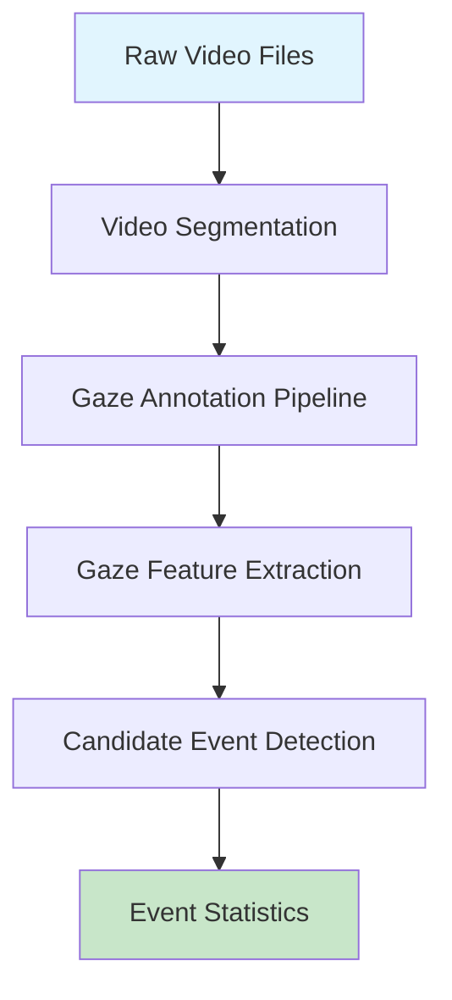

# Social Gesture Detection Pipeline Overview

A comprehensive documentation of the gaze-based social gesture detection pipeline, covering all stages from raw video input to final event statistics.

---

## Pipeline Summary



| Stage | Module | Purpose |
|-------|--------|---------|
| 1 | `segment_videos.py` | Split long videos into ≤120s chunks |
| 2 | `sam3_retinaface_gaze_pipeline.py` | Detect persons, faces, and estimate gaze |
| 3 | `gaze_feature_extractor.py` | Extract temporal gaze features |
| 4 | `candidate_event_detector.py` | Detect social gesture events |
| 5 | `event_stats.py` | Aggregate and report event statistics |

---

## Stage 1: Video Preprocessing

### Video Segmentation

> **Purpose**: Split long videos into manageable chunks (≤120 seconds) to optimize downstream processing.

| Parameter | Value | Description |
|-----------|-------|-------------|
| `min_segment_seconds` | 45 | Minimum segment length |
| `max_segment_seconds` | 120 | Maximum segment length |
| `adaptive_threshold` | 3.0 | Scene detection sensitivity |

**Process**:
1. Uses **PySceneDetect's AdaptiveDetector** to find natural scene boundaries
2. Enforces minimum segment length (45s) to avoid tiny clips
3. Splits segments exceeding 120s at natural boundaries
4. Outputs individual MP4 files, each ≤120 seconds

> [!NOTE]
> At 2fps sampling, a 120-second video yields **240 frames maximum**, simplifying memory management.

---

## Stage 2: Gaze Annotation Pipeline

### Pipeline Architecture


### 2.1 Frame Extraction
- **Sampling Rate**: 2.0 fps (configurable)
- **Library**: `decord` for efficient frame extraction
- **Calculation**: `frame_interval = original_fps / sample_fps`

### 2.2 SAM3 Person Tracking
- Uses **Segment Anything Model 3** with text prompt `"people"`
- Assigns consistent `person_id` across the video
- **Confidence threshold**: 0.45
- Outputs normalized bounding boxes and tracking scores

### 2.3 RetinaFace Face Detection
- Uses **InsightFace**'s `buffalo_l` model
- **Detection threshold**: 0.54
- Extracts 512-dim face embeddings for Re-ID
- Outputs face bounding boxes and landmarks

### 2.4 Face-to-Person Matching
- Uses **Hungarian Algorithm** for optimal bipartite matching
- Matches face bbox to **upper 50%** of person bbox (head region)
- Only accepts matches with non-zero IoU

### 2.5 GazeAnywhere Gaze Estimation
- Estimates where each detected face is looking
- Outputs normalized gaze point `(x, y)` in frame coordinates
- Provides `inout` flag: `true` = looking in-frame, `false` = out-of-frame

### 2.6 Timestamp Calculation

```python
timestamp = processed_frame_index / sample_fps
```

At 2fps: Frame 0 → 0.0s, Frame 1 → 0.5s, Frame 2 → 1.0s, etc.

### Output Format

```json
{
  "video_path": "/path/to/video.mp4",
  "video_fps": 29.97,
  "sample_fps": 2.0,
  "processed_frames": 240,
  "persons_summary": {
    "0": {"person_id": 0, "face_detection_pct": 0.85, ...}
  },
  "frames": [
    {
      "frame_idx": 0,
      "timestamp": 0.0,
      "persons": [
        {
          "person_id": 0,
          "face_bbox": [0.52, 0.15, 0.68, 0.35],
          "gaze_point": [0.62, 0.48],
          "inout": true,
          "face_detected": true
        }
      ]
    }
  ]
}
```

---

## Stage 3: Gaze Feature Extraction

> **Input**: `*_sam3rf.json` (gaze annotation files)  
> **Output**: `*_features.json` (temporal features)

### 3.1 Gaze Interpolation

Handles missing gaze data with a 3-tier strategy:

| Gap Size | Strategy | Confidence |
|----------|----------|------------|
| ≤3 frames | Linear interpolation | 1.0 - 0.1 × gap |
| 4-10 frames | Carry forward | 0.5 × exp(-0.2 × gap) |
| >10 frames | Keep as null | 0.0 |

> [!IMPORTANT]
> Scene cuts (>3 seconds gap or face displacement >30% of frame) block interpolation.

### 3.2 Per-Person Features

| Feature | Description |
|---------|-------------|
| `mean_velocity` | Average gaze movement speed |
| `max_velocity` | Peak gaze velocity (saccade detection) |
| `velocity_std` | Velocity variability |
| `mean_gaze_x/y` | Average gaze position |
| `gaze_spread` | Spatial dispersion of gaze points |
| `face_detection_pct` | % of frames with face detected |
| `inframe_gaze_pct` | % of frames looking in-frame |

### 3.3 Per-Frame Features

| Feature | Description |
|---------|-------------|
| `person_velocities` | Gaze velocity for each person |
| `person_gaze_points` | Normalized gaze coordinates |
| `person_gaze_confidences` | 1.0=measured, <1.0=interpolated |
| `person_face_centers` | Face bbox center (anchor) |
| `person_face_bboxes` | Full face bbox for mutual gaze |
| `person_gaze_directions` | Gaze direction relative to face |
| `gaze_convergence_score` | How clustered gaze points are (0-1) |
| `gaze_convergence_center` | Centroid of converging gaze |
| `pairwise_distances` | Gaze distance between person pairs |

### 3.4 Anchor-Based Features (Physics-Corrected)

Traditional gaze velocity is confounded by camera movement. The pipeline computes:

1. **Face Center (Anchor)**: Where the person is in the frame
2. **Gaze Direction**: `gaze_point - face_center` (camera-independent)
3. **Gaze Direction Velocity**: Movement of gaze direction, not gaze point

This correctly handles camera pans and scene changes.

### 3.5 Convergence Score Calculation

```python
# Robust to outliers using MEDIAN distance
for each gaze_point:
    distance_to_centroid = sqrt((gx - cx)² + (gy - cy)²)

median_dist = median(distances)
score = exp(-3.0 × median_dist)  # Range: 0-1
```

---

## Stage 4: Candidate Event Detection

> **Input**: `*_features.json` (gaze features)  
> **Output**: `*_events.json` (detected events)

### 4.1 Event Types

| Event Type | ID Range | Description |
|------------|----------|-------------|
| `sudden_gaze_shift` | 0-999 | Rapid gaze movement by one person |
| `joint_attention` | 1000-1999 | Multiple people looking at same region |
| `gaze_following` | 2000-2999 | Person B looks where Person A looked |
| `attention_capture` | 3000-3999 | Multiple people suddenly shift gaze |
| `mutual_gaze` | 4000+ | Two people looking at each other |

---

### 4.2 Sudden Gaze Shift Detection

**Definition**: Rapid gaze movement by a single person

| Parameter | Value | Purpose |
|-----------|-------|---------|
| `velocity_threshold` | 0.7 | Minimum velocity (normalized/sec) |
| `min_duration_sec` | 0.5 | Minimum event duration |
| `max_duration_sec` | 1.5 | Maximum event duration |

**Algorithm**:
1. Find frames where person's gaze velocity exceeds threshold
2. Cluster consecutive high-velocity frames (gap ≤0.6s)
3. Filter clusters by duration constraints
4. Confidence = `min(1.0, max_velocity / (threshold × 2))`

---

### 4.3 Joint Attention Detection

**Definition**: ≥2 people looking at the same spatial region

| Parameter | Value | Purpose |
|-----------|-------|---------|
| `convergence_threshold` | 0.6 | Minimum convergence score |
| `min_persons` | 2 | Minimum people involved |
| `min_duration_sec` | 0.5 | Minimum event duration |

**Algorithm**:
1. Find frames with high gaze convergence AND ≥2 faces detected
2. Cluster consecutive frames with similar participants (70% overlap)
3. Use **start frame** for participant list (avoids late-joiners)
4. Filter to only persons within 20% distance of convergence center
5. Confidence = mean convergence score across cluster

---

### 4.4 Gaze Following Detection

**Definition**: Person B looks where Person A was looking (with temporal lag)

| Parameter | Value | Purpose |
|-----------|-------|---------|
| `distance_threshold` | 0.03 | Maximum gaze point distance |
| `min_lag_sec` | 1.0 | Minimum time delay (A→B) |
| `max_lag_sec` | 2.0 | Maximum time delay |
| `min_event_confidence` | 0.9 | Only high-confidence events |

**Algorithm**:
1. Build gaze history per person (only high-confidence gaze)
2. For each person pair, check if B's gaze matches A's previous gaze
3. Match criteria: same location (within threshold) + appropriate lag
4. Merge overlapping events for same pair
5. Confidence = `1.0 - (distance / threshold)`

---

### 4.5 Attention Capture Detection

**Definition**: ≥3 people suddenly shift gaze simultaneously

| Parameter | Value | Purpose |
|-----------|-------|---------|
| `velocity_threshold` | 0.4 | Minimum velocity |
| `min_persons` | 3 | Minimum simultaneous shifters |
| `time_window_sec` | 0.5 | Clustering window |

**Algorithm**:
1. Find frames where ≥3 present persons have high velocity
2. Cluster by time AND participant overlap
3. Use start frame for participant list
4. Confidence = `min(1.0, mean_velocity / threshold)`

---

### 4.6 Mutual Gaze Detection

**Definition**: Two people looking at each other (eye contact)

| Parameter | Value | Purpose |
|-----------|-------|---------|
| `min_duration_sec` | 1.0 | Minimum duration (at 2fps = 2 frames) |
| `min_confidence` | 0.5 | Minimum gaze confidence |
| `margin` | 0.02 | Bbox hit tolerance (2% of frame) |

**Algorithm**:
1. For each frame, find persons with valid face bbox AND **measured** gaze
2. For each pair, check bidirectional gaze:
   - A's gaze inside B's face bbox? 
   - B's gaze inside A's face bbox?
3. Both conditions must be true → mutual gaze frame
4. Cluster consecutive mutual gaze frames (gap ≤1.5s)
5. Apply duration filter
6. Confidence = `0.5 + 0.1 × num_frames`

> [!IMPORTANT]
> **Only measured gaze is used** (not interpolated) to avoid false positives from stale data.

---

### 4.7 Output Format

```json
{
  "video_path": "/path/to/video.mp4",
  "num_events": 15,
  "event_counts": {
    "sudden_gaze_shift": 3,
    "joint_attention": 5,
    "gaze_following": 2,
    "attention_capture": 1,
    "mutual_gaze": 4
  },
  "events": [
    {
      "event_id": 1000,
      "event_type": "joint_attention",
      "start_time": 12.5,
      "end_time": 15.0,
      "start_frame": 25,
      "end_frame": 30,
      "confidence": 0.78,
      "persons_involved": [0, 1, 2],
      "details": {
        "max_convergence": 0.85,
        "attention_center": [0.52, 0.48],
        "duration": 2.5
      }
    }
  ]
}
```

---

## Stage 5: Event Statistics

> **Input**: Directory of `*_events.json` files  
> **Output**: Aggregated statistics to stdout

### Statistics Computed

| Metric | Description |
|--------|-------------|
| Files processed | Number of event JSON files |
| Total events | Sum across all files |
| Events by type | Count and percentage per event type |
| Events per file | Mean, median, min, max |

### Sample Output

```
============================================================
EVENT STATISTICS
============================================================
Event directory: /path/to/event_data
Files processed: 125
Total events: 1847

Event counts by type:
----------------------------------------
  joint_attention          :    723 ( 39.1%)
  mutual_gaze              :    456 ( 24.7%)
  sudden_gaze_shift        :    342 ( 18.5%)
  attention_capture        :    198 ( 10.7%)
  gaze_following           :    128 (  6.9%)
----------------------------------------

Events per file:
  Mean:   14.8
  Median: 12.0
  Min:    0
  Max:    67
============================================================
```

---

## Example Usage

### Complete Pipeline

```bash
# Step 1: Video Segmentation (optional if videos already ≤120s)
python video_segmentation/segment_videos.py \
    --input /path/to/raw_videos \
    --output /path/to/segmented_videos

# Step 2: Gaze Annotation
python gaze_annotation/batch_process_sam3rf_gaze.py \
    --input_dir /path/to/segmented_videos \
    --output_dir /path/to/gaze_data

# Step 3: Feature Extraction
python -m gaze_calculation.gaze_feature_extractor \
    --input_dir /path/to/gaze_data \
    --output_dir /path/to/gaze_data

# Step 4: Event Detection
python -m gaze_calculation.candidate_event_detector \
    --input_dir /path/to/gaze_data \
    --output_dir /path/to/event_data

# Step 5: Event Statistics
python -m gaze_calculation.event_stats \
    --event_dir /path/to/event_data
```

### Social Gesture Dataset Example

```bash
# Feature Extraction
python -m gaze_calculation.gaze_feature_extractor \
    --input_dir /projects/.../social_gesture/gaze_data \
    --output_dir /projects/.../social_gesture/gaze_data

# Event Detection
python -m gaze_calculation.candidate_event_detector \
    --input_dir /projects/.../social_gesture/gaze_data \
    --output_dir /projects/.../social_gesture/event_data

# Statistics
python -m gaze_calculation.event_stats \
    --event_dir /projects/.../social_gesture/event_data
```

---

## Key Design Decisions

### 1. Person Presence Filtering
All event detectors filter participants based on **actual frame presence** (`face_bbox is not None`), not just tracking ID existence. This prevents including people who were tracked but left the scene.

### 2. Start Frame Anchoring
For multi-frame events, **participant lists are anchored to the start frame**, not accumulated across the event. This provides a consistent definition of "who was involved."

### 3. Measured vs. Interpolated Gaze
- **Mutual gaze**: Only uses **measured** gaze (prevents false positives from stale data)
- **Joint attention**: Uses interpolated gaze with confidence weighting
- **Velocity events**: Uses interpolated gaze but with confidence-weighted velocity

### 4. Robust Statistics
Convergence scores use **median distance** (not mean) for robustness to outliers (e.g., one person looking away).

### 5. Scene Cut Handling
- Gaze interpolation blocked across gaps >3 seconds
- Face displacement >30% of frame triggers scene cut flag
- No velocity calculated across scene cuts

---

## File Naming Conventions

| Input | Output | Stage |
|-------|--------|-------|
| `video.mp4` | `video_sam3rf.json` | Gaze Annotation |
| `video_sam3rf.json` | `video_features.json` | Feature Extraction |
| `video_features.json` | `video_events.json` | Event Detection |

---

## Dependencies

| Package | Purpose |
|---------|---------|
| `numpy` | Numerical operations |
| `scipy` | Hungarian algorithm (linear_sum_assignment) |
| `torch` | Model inference |
| `decord` | Efficient video reading |
| `insightface` | RetinaFace face detection |
| SAM3 | Person tracking |
| GazeAnywhere | Gaze estimation |
